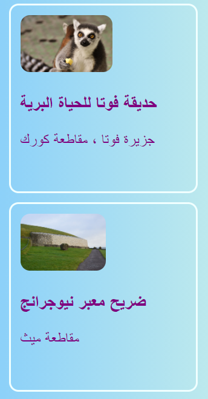

## بطاقات قابلة للنقر

إليك طريقة يمكنك استخدامها لإنشاء معرض صور ، أو صفحة معرض تعرض مشاريعك: **بطاقات المعاينة** مختصرة.



+ أضف كود HTML التالي إلى موقع الويب الخاص بك ، في أي مكان تريد. أنا أضفت `index.html`. يمكنك تغيير الصورة والنص لتناسب بطاقات المعاينة الخاصة بك. سأقوم بابراز مجموعة من المعالم السياحية في أيرلندا.

```html
    <article class="card">
        
        <h3> الحياة البرية في فوتا </h3>
        <p> جزيرة فوتا ، مقاطعة كورك </p>
    </article>
```


+ أضف رمز CSS التالي لإنشاء الفئات `بطاقة` و `صورة مصغرة`:

```css
    .tinyPicture {
        height: 60px;
        border-radius: 10px;
    }
    .card {
        width: 200px;
        height: 200px;
        border: 2px solid #F0FFFF;
        border-radius: 10px;
        box-sizing: border-box;
        padding: 10px;
        margin-top: 10px;
        font-family: "Trebuchet MS", sans-serif;
    }
    .card:hover {
        border-color: #1E90FF;
    }
```


دعنا نحول بطاقة المعاينة بأكملها إلى رابط حتى يتمكن الناس من النقر لرؤية المزيد من المعلومات.

+ ضع عنصر `المقالة` بأكمله داخل عنصر الرابط. تأكد من وضع وسم الإغلاق `</a>` بعد وسم الإغلاق `</article>`! لا تتردد في تغيير الرابط **URL** إلى كل ما تريد الارتباط به. قد تكون صفحة أخرى على موقع الويب الخاص بك ، أو قد تكون موقعًا آخر بالكامل.

```html
    <a href="attractions.html#scFota">  
        <article class="card ">
            
            <h3>الحياة البرية في فوتا</h3>
            <p> جزيرة فوتا، مقاطعة كورك</p>
        </article>
    </a>
```


--- collapse ---
---
title: الارتباط بجزء معين من الصفحة
---

لاحظ كيف أن قيمة `href` في الرابط الخاص بي تنتهي بـ `#scFota` ؟ هذه خدعة متقنة يمكنك استخدامها للانتقال إلى جزء معين من الصفحة.

+ أولاً ، اكتب عنوان URL للصفحة المراد الارتباط بها ، متبوعًا `#`.

+ في ملف التعليمات البرمجية للصفحة التي تتصل بها ، ابحث عن الجزء الذي تريد الانتقال إليه وإعطي هذا العنصر `معرف`, مثال, `<section id="scFota"`. قيمة `المعرف` هو ما تكتبه بعد `#` في الرابط الخاص بك.

--- /collapse ---

--- collapse ---
---
title: إعادة تعيين الأنماط
---

الآن بعد أن أصبحت بطاقة المعاينة بأكملها رابطًا ، فقد يكون خط النص قد تغير.

+ إذا كان كذلك ، يمكنك إصلاحه عن طريق إضافة فئة **CSS** إلى الرابط: `class = "cardLink"`. إليك رمز CSS الذي سيتم وضعه في ملف الأنماط الخاص بك:

```css
    .cardLink {
        color: inherit;
        text-decoration: none;
    }
```

تعيين قيمة أي خاصية إلى `inherit` يجعلها تستخدم القيمة التي يستخدمها عنصر **parent**. لذلك في هذه الحالة ، سوف يتطابق لون النص مع بقية النص على الصفحة الرئيسية.

--- /collapse ---

+ اصنع على الأقل أربع أو خمس من هذه البطاقات. إذا كنت تعمل من مثال موقع الويب الخاص بي ، فيمكنك القيام بواحد لكل قسم من أقسام صفحة الجذب السياحي. في بطاقة سوشي التالية ، ستتعرف على كيفية ترتيب البطاقات بخدعة رائعة!