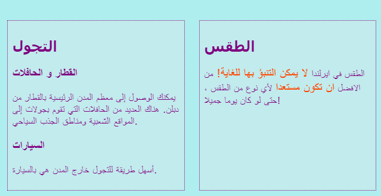
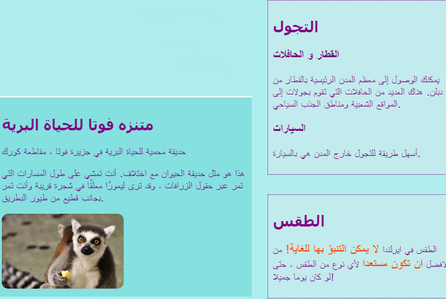
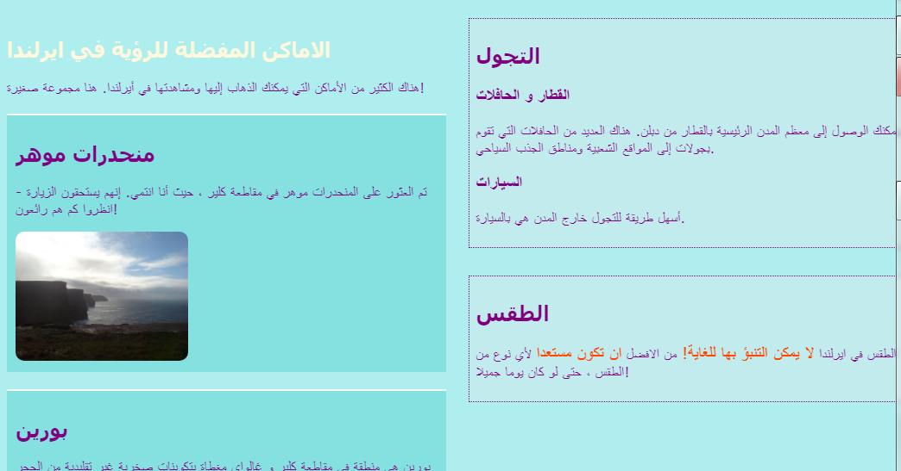

## تصميم تخطيط صفحة رائع

+ بالنسبة لهذه البطاقة ، يجب عليك العمل مع صفحة تحتوي على عنصر ` main` مع ثلاثة عناصر في الداخل: واحد `article` واثنين `aside`. Go ahead and create these first if you need to. إذا كنت ترغب في العمل في موقع الويب الخاص بي ، فقم بإضافة كود ` aside ` من بطاقة سوشي السابقة إلى صفحة الجذب السياحي. 

فيما يلي ثلاثة تخطيطات مختلفة للصفحة التي ستطبقها:


+ إضف فئات CSS جديدة إلى ` main ` وكل من العناصر الثلاثة التي ذكرناها بداخله.

```html
    <main class="attPageLayoutGrid">
        <article class="attGridArticle">
            <!--other stuff here-->
        </article>
        <aside class="attGridAside1">
            <!--other stuff here-->
        </aside>
        <aside class="attGridAside2">
            <!--other stuff here-->
        </aside>
    </main>
```

الحاوية التي ستقوم بتغيير تخطيطها هي ` main ` ، ولكن يمكنك القيام بذلك مع أي نوع من الحاويات ، مثل ` div ` أو ` article ` ، أو حتى الصفحة بأكملها ` body `. تسمى التقنية التي ستستخدمها ** CSS grid**.

في هذا المثال ، العنوان ` header` وتذييل الصفحة ` footer` سيتم تركه خارج التصميم ، ولكن من الشائع جدًا تضمينه في الشبكة أيضًا.

+ اضبط خاصية الشاشة ` display` اضبطها الي ` grid ` على الحاوية الشاملة:

```css
    .attPageLayoutGrid {
        display: grid;
        grid-column-gap: 0.5em;
        grid-row-gap: 1em;
    }
```

ما الذي تعتقد أن الخصائص `grid-column-gap` و `grid-row-gap` تفعل؟

+ بعد ذلك ، يمكنك تسمية ` grid-area` لكل عنصر: 

```css
    .attGridArticle {
        grid-area: agArticle;
    }
    .attGridAside1 {
        grid-area: agAside1;
    }
    .attGridAside2 {
        grid-area: agAside2;
    }
```

Then you design your layout! دعنا نضع العناصر الاثنين `aside` جنبًا إلى جنب في أسفل الصفحة. لهذا تحتاج إلى عمودين ** columns** متساويين في العرض. يمكنك الاحتفاظ بارتفاع الصف ** row** التلقائي.

+ ضع التعليمات البرمجية التالية داخل قواعد CSS `.attPageLayoutGrid `:

```css
    grid-template-rows: auto;
    grid-template-columns: 1fr 1fr;
    grid-template-areas: 
        "agArticle agArticle"
        "agAside1 agAside2";
```

`fr` stands for **fraction**. لاحظ كيف جعلت المقال `article ` يشغل كل المساحة على العمودين.

## \--- collapse \---

## title: المساعدة! لقد حصلت على أخطاء وتحذيرات!

إذا كنت تستخدم Trinket ، فقد تلاحظ ظهور بعض الأخطاء والتحذيرات ، حتى إذا قمت بكتابة الكود كما هو مذكور أعلاه. وذلك لأن Trinket لم يتعرف بعد على خصائص شبكة CSS. ومع ذلك ، فإن الكود لا يزال يعمل.

If the CSS grid code gives you 'unknown property' warnings or an error like 'unexpected token 1fr', you can simply ignore these.

\--- /collapse \---



دعنا نضع عناصر ` aside ` على اليمين ونجعلها نصف عرض العنصر `article `.

+ قم بتغيير قيم `grid-template-columns` و `grid-template-areas` إلى:

```css
    grid-template-columns: 2fr 1fr;
    grid-template-areas: 
        "agArticle agAside1"
        "agArticle agAside2";
```



+ If you don't want the `aside` elements to stretch all the way to the bottom, you can add a blank space using a dot: 

```css
    grid-template-areas: 
        "agArticle agAside1"
        "agArticle agAside2"
        "agArticle . ";
```



\--- challenge \---

## Challenge: قم بعمل تخطيطات مختلفة لأحجام مختلفة للشاشة

+ هل يمكنك استخدام اختبارات حجم الشاشة التي قمت بإضافتها سابقًا لإجراء تغيير في التخطيط حسب حجم الشاشة؟ ملاحظة: إذا قمت بالفعل بإنشاء كتل CSS لكل حجم شاشة ، فيمكنك إضافة كود CSS الجديد إلى تلك الكتل بدلاً من إنشاء كتل جديدة.

\--- hints \---

\--- hint \---

يحدد الكود التالي تخطيطًا لفئة CSS أعلاه عندما تكون الشاشة أكبر من 1000 بكسل:

```css
    @media all and (min-width: 1000px) {
        .attPageLayoutGrid {
            grid-template-columns: 1fr 1fr;
            grid-template-areas: 
                "agArticle agArticle"
                "agAside1 agAside2";
        }
    }  
```

\--- hint/ \---

\--- hint \---

يحدد الكود التالي تخطيطًا لفئة CSS أعلاه عندما تكون الشاشة أكبر من 1600 بكسل:

```css
    @media all and (min-width: 1600px) {
        .attPageLayoutGrid {
            grid-template-columns: 1fr 1fr;
            grid-template-areas: 
                "agArticle agAside1"
                "agArticle agAside2"
                "agArticle .";
        }
    }  
```

\--- hint/ \---

\--- hints/ \---

\--- challenge/ \---

مع ** شبكة CSS ** ، يمكنك إجراء أي تخطيط تقريبًا. إذا كنت تريد معرفة المزيد، قم بالنقر[ dojo.soy/html3-css-grid ](http://dojo.soy/html3-css-grid) {:target="_blank"}