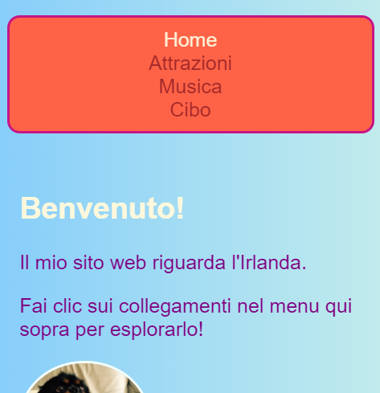

## Rendi il tuo menu reattivo

Un sito web si dice **reattivo** quando si adatta alle dimensioni dello schermo, in modo che l'aspetto sia sempre fantastico, sia che lo si guardi su un computer, un cellulare o un tablet. Rendiamo il tuo menu reattivo!

Inizierai con gli stili normali: questa sarà il comportamento **default**.

## \--- collapse \---

## title: Cosa significa "default"?

Gli stili di default sono i set di regole stilistiche predefiniti. Vengono applicati indipendentemente da tutto, prima di verificare eventuali condizioni speciali.

È possibile aggiungere del codice che controlla la dimensione dello schermo e apporta alcune modifiche se necessario.

\--- /collapse \---

+ Aggiungi il seguente codice CSS al tuo menu. Probabilmente hai definito anche i colori e i bordi; li ho lasciati fuori per risparmiare spazio qui! Se hai già definito il codice CSS per il tuo menu, aggiungi o modifica le proprietà e i valori qui sotto che ti mancano.

```css
    nav ul {
        padding: 0.5em;
        display: flex;
        flex-direction: column;
    }
    nav ul li {
        text-align: center; 
        list-style-type: none;
        margin-right: 0.5em;
        margin-left: 0.5em;
    }
```

Con il codice CSS di sopra, il tuo menu sarà più adatto a schermi piccoli. Questo si chiama **mobile-first** development.



## \--- collapse \---

## title: Cosa significa 'mobile-first'?

Molto spesso, quando programmi un sito web usi lo schermo di un computer, e probabilmente definisci i tuoi stili in base a come appare su quello schermo.

Quando all'inizio prepari il codice per dispositivi mobili, sceglierai invece gli stili predefiniti adatti per schermi di piccole dimensioni come quelli degli smartphone. Successivamente, aggiungerai del codice extra per fare degli adattamenti per gli schermi più grandi.

Dal momento che sempre più persone navigano in Internet sui propri smartphone o tablet anziché su un computer, è buona norma sviluppare il sito web tenendone conto.

\--- /collapse \---

+ Ora aggiungi il seguente codice al tuo stylesheet:

```css
    @media all and (min-width: 1000px) {
        nav ul {
            flex-direction: row;
            justify-content: space-around;
        }
    }
```

La prima riga di codice qua sopra controlla quali sono le dimensioni della finestra del browser. Se la finestra è larga **1000 pixel** o più, applicherà tutte le regole di stile all'interno del blocco.


## \--- collapse \---

## title: Come funziona?

Il blocco contiene nuovi valori solo per alcune proprietà del menu `nav ul`.

Ogni volta che la finestra è più larga di 1000 pixel, questi nuovi valori verranno applicati al posto di quelli già definiti per `nav ul`.

Il resto delle proprietà che hai definito precedentemente per `nav ul` rimarrà lo stesso.

\--- /collapse \---

+ Se stai utilizzando Trinket per scrivere codice, potrebbe essere utile scaricare il progetto in modo da poterlo testare a schermo intero.

\--- challenge \---

## Sfida: fai in modo che il tuo menù si adatti automaticamente per schermi grandi

+ Riesci ad aggiungere un altro blocco per schermi più grandi di **1600 pixel**, con `flex-end` invece di `space-around`?


\--- hints \---

\--- hint \---

Il seguente codice definisce le proprietà flex per le voci del menu quando lo schermo è più grande di 1600 pixel:

```css
    @media all and (min-width: 1600px) {
        nav ul {
            flex-direction: row;
            justify-content: flex-end;
        }
    }  
```

\--- /hint \---

\--- /hints \---

\--- /challenge \---

Puoi mettere qualunque codice CSS che ti piace in blocchi come questi per definire stili diversi per diverse dimensioni di schermo. Sarà particolarmente utile quando farai i layout CSS a griglia più tardi!