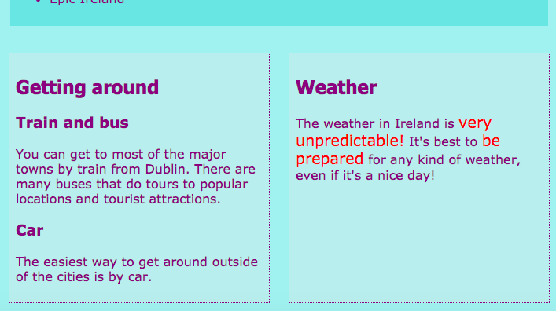

## ತಂಪಾದ ಪುಟ ವಿನ್ಯಾಸಗಳನ್ನು ವಿನ್ಯಾಸಗೊಳಿಸಿ

+ ಈ ಕಾರ್ಡ್‌ಗಾಗಿ ನೀವು ಒಳಗೆ ಮೂರು ಅಂಶಗಳೊಂದಿಗೆ `main` ಅಂಶವನ್ನು ಹೊಂದಿರುವ ಪುಟದೊಂದಿಗೆ ಕೆಲಸ ಮಾಡಬೇಕು: ಒಂದು `article` ಮತ್ತು ಎರಡು `aside` ಗಳು. ನಿಮಗೆ ಅಗತ್ಯವಿದ್ದರೆ ಮುಂದುವರಿಯಿರಿ ಮತ್ತು ಮೊದಲು ಇವುಗಳನ್ನು ರಚಿಸಿ. ನೀವು ನನ್ನ ವೆಬ್‌ಸೈಟ್‌ನೊಂದಿಗೆ ಕೆಲಸ ಮಾಡಲು ಬಯಸಿದರೆ, ಅನ್ನು `aside` ಸೇರಿಸಿ ಹಿಂದಿನ ಸುಶಿ ಕಾರ್ಡ್‌ನಿಂದ ಆಕರ್ಷಣೆಗಳ ಪುಟಕ್ಕೆ ಕೋಡ್. 

ನೀವು ಅನ್ವಯಿಸುವ ಮೂರು ವಿಭಿನ್ನ ಪುಟ ವಿನ್ಯಾಸಗಳು ಇಲ್ಲಿವೆ:


+ `main` ಹೊಸ CSS ತರಗತಿಗಳನ್ನು ಸೇರಿಸಿ ಮತ್ತು ಅದರೊಳಗಿನ ಮೂರು ಅಂಶಗಳು.

```html
    <main class="attPageLayoutGrid">
        <article class="attGridArticle">
            <!--other stuff here-->
        </article>
        <aside class="attGridAside1">
            <!--other stuff here-->
        </aside>
        <aside class="attGridAside2">
            <!--other stuff here-->
        </aside>
    </main>
```

ನೀವು ವಿನ್ಯಾಸವನ್ನು ಬದಲಾಯಿಸುವ ಕಂಟೇನರ್ `main`, ಆದರೆ ನೀವು ಇದನ್ನು `div` ನಂತಹ ಯಾವುದೇ ರೀತಿಯ ಕಂಟೇನರ್‌ನೊಂದಿಗೆ ಮಾಡಬಹುದು ಅಥವಾ `article`, ಅಥವಾ ಇಡೀ ಪುಟ `boby`. ನೀವು ಬಳಸಲು ಹೊರಟಿರುವ ತಂತ್ರವನ್ನು **CSS grid** ಎಂದು ಕರೆಯಲಾಗುತ್ತದೆ.

ಈ ಉದಾಹರಣೆಯಲ್ಲಿ, `header` ಮತ್ತು `footer` ವಿನ್ಯಾಸದಿಂದ ಹೊರಗುಳಿಯಲಾಗುವುದು, ಆದರೆ ಅವುಗಳನ್ನು ಗ್ರಿಡ್‌ನಲ್ಲಿ ಸೇರಿಸುವುದು ತುಂಬಾ ಸಾಮಾನ್ಯವಾಗಿದೆ.

+ `display`ನವನ್ನು ಹೊಂದಿಸಿ `grid`‌ಗೆ ಆಸ್ತಿ ಒಟ್ಟಾರೆ ಪಾತ್ರೆಯಲ್ಲಿ:

```css
    .attPageLayoutGrid {
        display: grid;
        grid-column-gap: 0.5em;
        grid-row-gap: 1em;
    }
```

`grid-column-gap` ಏನು ಎಂದು ನೀವು ಯೋಚಿಸುತ್ತೀರಿ ಮತ್ತು `grid-row-gap` ಗುಣಲಕ್ಷಣಗಳು ಮಾಡುತ್ತವೆ?

+ ಮುಂದೆ, ನೀವು `grid-area`ವನ್ನು ಹೆಸರಿಸಿ ಪ್ರತಿ ಅಂಶಕ್ಕೆ: 

```css
    .attGridArticle {
        grid-area: agArticle;
    }
    .attGridAside1 {
        grid-area: agAside1;
    }
    .attGridAside2 {
        grid-area: agAside2;
    }
```

ನಂತರ ನೀವು ನಿಮ್ಮ ವಿನ್ಯಾಸವನ್ನು ವಿನ್ಯಾಸಗೊಳಿಸುತ್ತೀರಿ! ಎರಡು ಅನ್ನು `aside` ಇಡೋಣ ಅಂಶಗಳು ಪುಟದ ಕೆಳಭಾಗದಲ್ಲಿ ಅಕ್ಕಪಕ್ಕದಲ್ಲಿರುತ್ತವೆ. ಇದಕ್ಕಾಗಿ ನಿಮಗೆ ಎರಡು **columns** ಬೇಕಾಗುತ್ತವೆ ಸಮಾನ ಅಗಲ. ನೀವು **row** ಇರಿಸಬಹುದು ಎತ್ತರ ಸ್ವಯಂಚಾಲಿತ.

+ ಕೆಳಗಿನ ಕೋಡ್ ಅನ್ನು `.attPageLayoutGrid` ಒಳಗೆ ಇರಿಸಿ CSS ನಿಯಮಗಳು:

```css
    grid-template-rows: auto;
    grid-template-columns: 1fr 1fr;
    grid-template-areas: 
        "agArticle agArticle"
        "agAside1 agAside2";
```

`fr` **fraction** ಸೂಚಿಸುತ್ತದೆ. ನೀವು `article`ವನ್ನು ಹೇಗೆ ಮಾಡುತ್ತೀರಿ ಎಂಬುದನ್ನು ಗಮನಿಸಿ ಎರಡು ಕಾಲಮ್‌ಗಳ ಮೇಲೆ ಎಲ್ಲಾ ಜಾಗವನ್ನು ತೆಗೆದುಕೊಳ್ಳಿ.

## \--- collapse \---

## title: Help! I got errors and warnings!

If you are using Trinket, you may notice some errors and warnings appear, even if you typed the code exactly as above. This is because Trinket does not yet recognise the CSS grid properties. However, the code will still work.

If the CSS grid code gives you 'unknown property' warnings or an error like 'unexpected token 1fr', you can simply ignore these.

\--- /collapse \---



Let's put the `aside` elements over on the right and make them half the width of the `article`.

+ Change the values of `grid-template-columns` and `grid-template-areas` to:

```css
    grid-template-columns: 2fr 1fr;
    grid-template-areas: 
        "agArticle agAside1"
        "agArticle agAside2";
```


+ If you don't want the `aside` elements to stretch all the way to the bottom, you can add a blank space using a dot: 

```css
    grid-template-areas: 
        "agArticle agAside1"
        "agArticle agAside2"
        "agArticle . ";
```


\--- challenge \---

## Challenge: make different layouts for different screen sizes

+ Can you use the screen size checks you added earlier to make the layout change depending on how wide the screen is? Note: if you already created CSS blocks for each screen size, you can add the new CSS code to those blocks instead of creating new ones.

\--- hints \---

\--- hint \---

The following code defines a layout for the CSS class above when the screen is bigger than 1000 pixels:

```css
    @media all and (min-width: 1000px) {
        .attPageLayoutGrid {
            grid-template-columns: 1fr 1fr;
            grid-template-areas: 
                "agArticle agArticle"
                "agAside1 agAside2";
        }
    }  
```

\--- /hint \---

\--- hint \---

The following code defines a layout for the CSS class above when the screen is bigger than 1600 pixels:

```css
    @media all and (min-width: 1600px) {
        .attPageLayoutGrid {
            grid-template-columns: 1fr 1fr;
            grid-template-areas: 
                "agArticle agAside1"
                "agArticle agAside2"
                "agArticle .";
        }
    }  
```

\--- /hint \---

\--- /hints \---

\--- /challenge \---

With **CSS grid**, you can make almost any layout you like. If you want to learn more, go to [dojo.soy/html3-css-grid](http://dojo.soy/html3-css-grid){:target="_blank"}