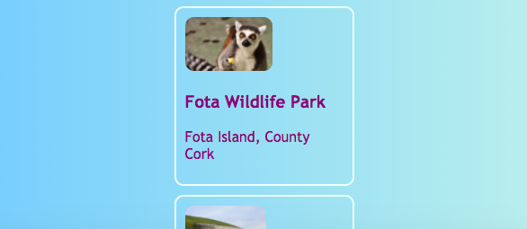

## एका ओळीत

या कार्डवर आपण, एका पृष्ठावर गोष्टींची व्यवस्था **horizontally** करण्यासाठी काही युक्त्या शिकू शकता. प्रथम, आपण सामग्री केंद्रीत कशी करावी हे पहाल. नंतर आपण एका ओळीत बाजूबाजूला अशी घटकांची व्यवस्था कराल.

+ पुढील CSS properties `.card` वर्गात जोडा:

```css
    margin-left: auto;
    margin-right: auto;
```

आपण पृष्ठाच्या मध्यभागी कार्डे हलताना पाहिले पाहिजेत. आपण कुठल्याही घटकाला डाव्या बाजू ऐवजी मध्यभागी आणण्यासाठी उजवा आणि डावा समास `auto` असा सेट करा.



+ पृष्ठ अरुंद आणि विस्तृत करण्यासाठी ब्राउझर विंडोची कड ओढून घ्या - कार्डे केंद्रीत ठेवण्याचे लक्षात ठेवा.

+ आपण नुकतेच तयार केलेले सर्व कार्ड लिंक्स एका नवीन कंटेनर घटकामध्ये ठेवा. याला `article` किंवा `section`, नव्हे तर एक`div` म्हणता येईल. हा एक सामान्य-हेतू कंटेनर आहे ज्याचा आपण गोष्‍टी एकत्र करणे आणि छान छान ले आऊट तयार करण्यासाठी वापरू शकता.

```html
    <div class="cardContainer">
```

+ आपल्या शैली पत्रकात पुढील CSS कोड जोडा:

```css
    .cardContainer {
        display: flex;
        flex-wrap: wrap;
        justify-content: space-around;
        padding: 10px;
    }
```

Voilà! आपली कार्ड आता बाजूने दर्शविली जात आहेत **Flex** ला धन्यवाद!

+ वेबसाइट विस्तीर्ण आणि संकुचित करण्यासाठी आपल्या विंडोची कड ओढा आणि चौकटीच्या आकारात फिट बसण्यासाठी कार्डे कसे फिरतात, कधीकधी पुढील ओळीवर लपेटतात, ते पहा,.


+ `width` आणि `height` या प्रॉपर्टी `.card` वर्गातून वगळण्याचा प्रयत्न करा आणि बघा काय होते आहे ते:`flex` अत्यंत हुशारीने, एका ओळीतील सर्व गोष्टी एकाच उंचीच्या करून एखाद्या जिगसॉ कोड्यासारखे अचूक बसवते.


आपल्या पृष्ठाच्या शीर्षस्थानी आपल्याकडे नेव्हिगेशन मेनू असल्यास आपण ही युक्ती वापरू शकता असे हे आणखी एक ठिकाण आहे. पुढील कामासाठी आपले मेनू, सूची घटकानी ( (`li`) बनलेले असणे आवश्यक आहे. आपल्याला आवडल्यास, आपण माझ्या वेबसाइट वापरून पहा.

+ मेनूसाठी CSS नियम शोधा. माझ्या लिंकवर `nav ul`, `nav ul li`, and `nav ul li a` हे ब्लॉक आहेत.

+ यादीतील घटकातून `display: inline;` ही प्रॉपर्टी वगळा. नंतर, सूचीमध्ये `nav ul`, यामध्ये जोडा:

```css
    display: flex;
    justify-content: flex-start;
```


आपण त्याच मेनूसह काम संपवता, बरोबर? `flex` बद्दल छान गोष्ट ही आहे की आपण `justify-content` प्रॉपर्टी वापरुन लेआउट नियंत्रित करू शकता.

+ `justify-content` चे मूल्य `flex-end` अशी बदलून पहा आणि बघा काय होते ते. किंवा आपण कार्ड साठी केले तसे मेनू आयटेम समान अंतरावर करण्यासाठी `space-around` मध्ये बदला.


**`flex`** हे स्वत: ची संपूर्ण सुशी कार्ड मालिका भरू शकणारे, एक सुंदर शक्तिशाली लेआउट साधन आहे - आपण त्याबद्दल [dojo.soy/html3-flex](http://dojo.soy/html3-flex) येथे अधिक जाणून घेऊ शकता.