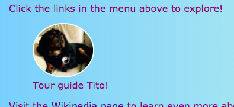

## मथळे आणि साइड नोट्स

या कार्डवर आपण **container** घटकांच्या आणखी दोन प्रकारांबद्दल जाणून घ्या: आपण चित्रामध्ये मथळा (शीर्षक किंवा लहान वर्णनासारखे काही मजकूर) जोडण्यासाठी वापरू शकता आणि दुसरे आपल्याकडे पृष्ठावरील मुख्य माहितीव्यतिरिक्त असलेल्या अतिरिक्त सामग्रीसाठी.

### मथळ्यांसह चित्रे

+ आपल्याकडे ज्याच्या वर किंवा खाली चित्रासह टेक्स्ट आहे त्या आहे असा `img` घटक शोधा. मी `index.html` वरील टिटो चित्रावर काम करीत आहे, परंतु आपण आपल्या वेबसाइटवर जे काही आहे त्यावर काम करू शकता. 

```html
            
  <p>
    Tour guide Tito!
  </p>
```

+ कोडच्या वरील ओळीवर, प्रारंभिक टॅग `<figure>` जोडा. कोडच्या खाली नवीन ओळीवर, अंतिम टॅग `</figure>` जोडा.

+ पुढे, `p` हा टॅग काढा किंवा मजकूराच्या आसपास आपल्याकडे असलेले कोणतेही टॅग काढा (कदाचित हे `h2`? सारखे शीर्षक असेल) आणि त्याऐवजी `<figcaption> </figcaption>` दरम्यान मजकूर ठेवा. सगळे मिळून यासारखे काहीतरी दिसायला हवे:

```html
  <figure>
                
      <figcaption>
      Tour guide Tito!
      </figcaption>
  </figure>
```

`figcaption` घटक म्हणजे आपले **caption**. हे एकतर `img` घटकाच्या वर किंवा त्याखाली जाऊ शकते.



## \--- collapse \---

## title: हे का उपयुक्त आहे?

`figure`घटक आपल्या चित्र आणि त्याच्या मथळ्यासाठी **container** चे कार्य करतो. शैली परिभाषित करताना हे आपल्याला त्यांना एकच युनिट मानण्याची परवानगी देते.

तार्किकदृष्ट्या, त्यांचे एकत्रिकरण करणे, आपल्या संकेतस्थळाच्या कोडमध्ये चांगली रचना राखण्यासाठी मदत करते.

\--- /collapse \---

`figure` आणि `figcaption` यांच्या शैलीसाठी, आपण वर्ग, आयडी किंवा घटक निवडकांच्यासाठी जसा वापर करता तसाच CSS कोडचा वापर करू शकता. नवीन कंटेनरमुळे निर्माण झालेल्या अतिरिक्त रिकाम्या जागा हटवण्यासाठी, मी खालील नियम जोडत आहे:

```css
  figure { 
      margin-top: 0px;
      margin-bottom: 0px;
      margin-left: 0px;
      margin-right: 0px;
  }
```

### साइड नोट्स

माझ्या संकेतस्थळावरील आकर्षणे पृष्ठावर, भेट देत येतील अश्या ठिकाणांची यादी आहे. मला हवामान आणि आजूबाजूला कसे फिरायचे याबद्दल काही टिप्पण्या जोडायच्या आहेत. ती माहिती खरेतर सर्व आकर्षणासह `article`घटकाशी संबंधित नाही. आपण `aside` घटक कधी वापरू शकता त्याचे हे एक उदाहरण आहे.

+ `article` घटक असलेल्या आपल्या संकेतस्थळाच्या पृष्ठावर जा - मी `attractions.html` वापरत आहे.

+ `article` च्या **Outside** घटकापैकी `<aside> </aside>` आपली अतिरिक्त सामग्री असलेल्या टॅगच्या एक किंवा अधिक जोड्या जोडा.

```html
  <aside class="sideNoteStyle">
      <h2>Getting around</h2>
      <h3>Train and bus</h3>
      <p>You can get to most of the major towns by train from Dublin. There are many buses that do tours to popular locations and tourist attractions.</p>
      <h3>Car</h3>
      <p>The easiest way to get around outside of the cities is by car.</p>
    </aside>
    <aside class="sideNoteStyle">
      <h2>Weather</h2>
      <p>The weather in Ireland is <span class="specialText">very unpredictable!</span> It's best to <span class="specialText">be prepared</span> for any kind of weather, even if it's a nice day!</p>
  </aside>
```

## \--- collapse \---

## title: हे का उपयुक्त आहे?

`aside`, `article`,, आणि इतर सर्व कंटेनर समान आहेत. अर्थात **meaning** मध्येच फक्त वास्तविक फरक आहे, म्हणूनच तर आपण त्यांचा वापर करता.

जेव्हाही शक्य असेल तेव्हा अर्थपूर्ण एचटीएमएल घटक वापरणे महत्वाचे आहे. हे आपल्या वेबसाइटला चांगली रचना देते आणि **screen readers** वापरणार्‍या लोकांसाठी विशेषतः उपयुक्त आहे.

\--- /collapse \---

आपल्याला तेथे इतर घटक आढळले, `span`? हा एक विशेष टॅग आहे जो आपण फक्त अतिरिक्त CSS कोड जोडण्यासाठी वापरू शकता! `span` टॅग जोडीच्या दरम्यान आपण काहीही ठेवू शकता. परिच्छेदामध्ये मजकूराचा **part** स्टाईल करण्यासारख्या गोष्टींसाठी हे उपयुक्त आहे.

+ वरील एचटीएमएल कोडचे स्टाईलिंग पूर्ण करण्यासाठी आपल्या CSS कोडमध्ये खालील सीएसएस कोड जोडा.

```css
  .sideNoteStyle {
    border: dotted 1px purple;
    background-color: #c1ebec;
    padding: 0.5em;
    margin: 0.5em;
  }
  .specialText {
      color: #FF4500;
      font-size: larger;
  }
```


आपल्या वेबसाइटचा लेआउट अधिक मनोरंजक कसा बनवायचा हे आपण पुढील कार्डवर शिकणार आहात!

+ सज्ज होण्यासाठी, `article` आणि `<main> </main>` टॅग च्या मध्ये दोन `aside` घटक आहेत असे एक पृष्ठ बनवा. किंवा आपल्याला हवे असल्यास, आपण माझ्या संकेतस्थळावरील आकर्षण पृष्ठावर काम करू शकता.