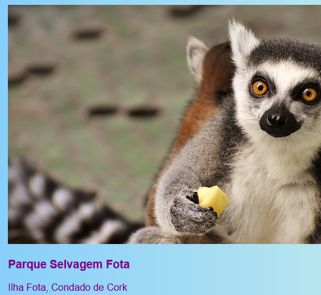
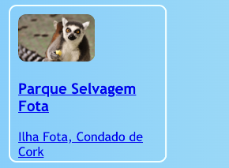

## Cartões clicáveis

Aqui está uma técnica que você pode usar para criar uma galeria de fotos ou uma página de portfólio mostrando seus projetos: pequenos **cartões de visualização**.


+ Adicione o seguinte código HTML ao seu site, onde quiser. Estou fazendo o meu no `index.html`. Você pode alterar a imagem e o texto para se adequar aos seus próprios cartões de visualização. Eu vou fazer um monte de destaques das atrações turísticas na Irlanda.

```html
    <article class="card">
        
        <h3>Parque Selvagem Fota</h3>
        <p>Ilha Fota, Condado de Cork</p>
    </article>
```



+ Adicione o seguinte código CSS para criar as classes `card` e `tinyPicture`:

```css
    .tinyPicture {
        height: 60px;
        border-radius: 10px;
    }
    .card {
        width: 200px;
        height: 200px;
        border: 2px solid #F0FFFF;
        border-radius: 10px;
        box-sizing: border-box;
        padding: 10px;
        margin-top: 10px;
        font-family: "Trebuchet MS", sans-serif;
    }
    .card:hover {
        border-color: #1E90FF;
    }
```


Vamos transformar o cartão de visualização em um link para que as pessoas possam clicar para ver mais informações.

+ Coloque todo o elemento `article` dentro de um elemento de link. Certifique-se de que a tag de fechamento `</a>` esteja depois da tag de fechamento `</article>`! Feel free to change the link **URL** to whatever you want to link to. That could be another page on your website, or it could be another website entirely.

```html
    <a href="attractions.html#scFota">  
        <article class="card ">
            
            <h3>Fota Wildlife Park</h3>
            <p>Fota Island, County Cork</p>
        </article>
    </a>
```



## \--- collapse \---

## title: Linking to a specific part of a page

Notice how the value of `href` in my link ends in `#scFota`? This is a neat trick you can use to jump to a particular part of a page.

+ First, type the URL of the page to link to, followed by `#`.

+ In the code file for the page you are linking to, find the part you want to jump to and give that element an `id`, for example, `<section id="scFota"`. The value of the `id` is what you type after the `#` in your link.

\--- /collapse \---

## \--- collapse \---

## title: Resetting styles

Now that the whole preview card is a link, the text font may have changed.

+ If so, you can fix it by adding a **CSS class** to the link: `class="cardLink"`. Here's the CSS code to put in your style sheet:

```css
    .cardLink {
        color: inherit;
        text-decoration: none;
    }
```

Setting the value of any property to `inherit` makes it use the value that the **parent** element has. So in this case, the text colour will match the rest of the text on the homepage.

\--- /collapse \---

+ Make at least four or five of these cards. If you are working from my example website, you could do one for each of the sections on the Attractions page. On the next Sushi Card, you'll learn how to arrange the cards with a cool trick!