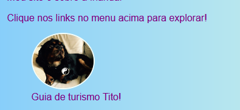
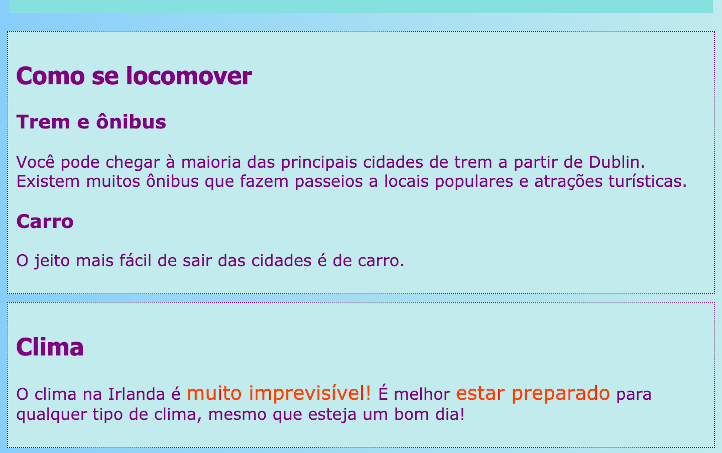

## Legendas e notas laterais

Neste passo, você aprenderá mais dois tipos de elemento **contêiner**: um que você pode usar para adicionar uma legenda (algum texto como título ou descrição curta) à imagem, e outra para quando você tem algo extra que realmente não pertencem às informações principais de uma página.

### Imagens com legendas

+ Encontre um elemento `img` onde você tem texto acima ou abaixo que combina com a imagem. Estou trabalhando com a imagem do Tito em `index.html`, mas você pode usar o que estiver no seu site. 

```html
  <0 />          
  <p>
    Guia turístico Tito!
  </p>
```

+ Na linha acima do código, adicione a tag de abertura `<figure>`. Em uma nova linha abaixo do código, coloque a tag de fechamento `</figure>`.

+ Em seguida, remova as tags `p` ou quaisquer tags que você tem em torno do texto (talvez seja um cabeçalho, como `h2`?), e coloque o texto entre tags `<figcaption> </figcaption>` em vez disso. Tudo deve ser parecido com isto:

```html
  <figure>
                
      <figcaption>
      Guia turístico Tito!
      </figcaption>
  </figure>
```

O elemento `figcaption` é sua **legenda**. Ele pode ir acima do elemento `img` ou abaixo dele.



--- collapse ---
---
title: Por que isso é útil?
---

O elemento `figura` atua como um tipo de **contêiner** para sua imagem e legenda. Isso permite que você os trate como uma unidade ao definir estilos.

Agrupá-los juntos logicamente também ajuda a manter uma boa estrutura no código do seu site.

--- /collapse ---

Você pode usar o código CSS para estilizar `figure` e `figcaption` como qualquer outro elemento usando classes, IDs ou seletores de elementos. Estou adicionando as seguintes regras para remover o espaçamento extra que foi adicionado pelo novo contêiner:

```css
  figure { 
      margin-top: 0px;
      margin-bottom: 0px;
      margin-left: 0px;
      margin-right: 0px;
  }
```

### Notas laterais

A página Atrações no meu site é uma lista de lugares para visitar. Quero adicionar algumas notas sobre o clima e como se locomover. Essa informação não pertence realmente ao elemento `article` com todas as atrações. Este é um exemplo de quando você pode usar o elemento `aside`.

+ Vá para uma página do seu site com um elemento `article` nele - estou usando `attractions.html`.

+ **Fora** do elemento `article`, adicione um ou mais pares de tags `<aside> </aside>` que contêm sua informação extra.

```html
  <aside class="sideNoteStyle">
      <h2>Como se locomover</h2>
      <h3>Trem e ônibus</h3>
      <p>Você pode chegar à maioria das principais cidades de trem a partir de Dublin. Existem muitos ônibus que fazem passeios a locais populares e atrações turísticas. </p>
      <h3>Carro</h3>
      <p>A maneira mais fácil de se locomover fora das cidades é de carro.</p>
    </aside>
    <aside class="sideNoteStyle">
      <h2>Clima</h2>
      <p>O clima na Irlanda é <span class="specialText">muito imprevisível!</span> É melhor <span class="specialText">estar preparado</span> para qualquer tipo de clima, mesmo que seja um bom dia!</p>
  </aside>
```

--- collapse ---
---
title: Por que isso é útil?
---

`aside`, `article` e outros contêineres são todos similares. A única diferença real é no **significado**, ou seja, para que você os usa.

É importante usar elementos HTML significativos sempre que possível. Ele fornece uma melhor estrutura ao seu site e é especialmente útil para pessoas que usam **leitores de tela**.

--- /collapse ---

Você localizou o outro elemento lá, `span`? Essa é uma tag especial que você pode usar apenas para adicionar código CSS extra! Você pode colocar qualquer coisa entre um par de tags `span`. É útil para coisas como estilizar uma **parte** do texto em um parágrafo.

+ Adicione o seguinte código CSS à sua folha de estilos para concluir o estilo do código HTML acima.

```css
  .sideNoteStyle {
    border: dotted 1px purple;
    background-color: #c1ebec;
    padding: 0.5em;
    margin: 0.5em;
  }
  .specialText {
      color: #FF4500;
      font-size: larger;
  }
```



No próximo passo, você aprenderá como tornar o layout do seu site mais interessante!

+ Para se preparar, crie uma página com um elemento `article` e dois elementos `aside` dentro das tags `<main> </main>`. Ou, se preferir, você pode trabalhar com a página Atrações no meu site.